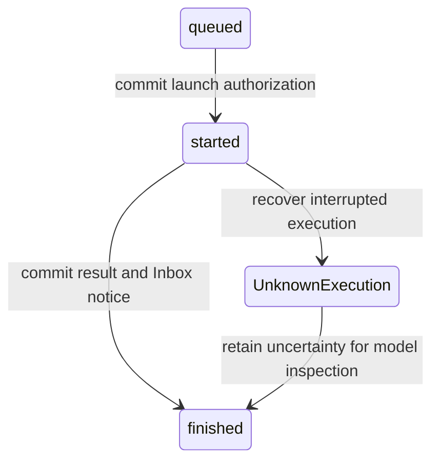

# Durable Sessions

`rio run` uses SQLite State and independent Python scripts. The earlier notebook
runtime remains available with `--runtime notebook`, including its JSONL sessions,
Jupyter magics, MCP integration, and coding extension hooks.

```sh
rio run "Fix the route and run its tests"
rio run --resume SESSION_ID
rio run --runtime notebook "Use an existing notebook workflow"
```

A resume keeps the original goal, limits, model configuration, accepted work, and
recorded results. It does not start a new task or revive a terminal run. Start a
new Session for another attempt. Durable journals live at
`~/.rio/sessions/durable/SESSION_ID.sqlite3`.

## Commit boundaries



One `step` call commits a restricted JSON Patch. Cells are immutable; a successor
gets a new integer ID and points to its predecessor. New code versions request
one execution. Removing a Cell prunes context without cancelling its work or
removing its history. Failed and interrupted executions pause the queue until
the model consumes their observations in an accepted patch.

The owner prepares a fixed State for each model round. Later observations enter
Inbox and cannot invalidate that snapshot or silently clear a newer dispatch
pause. Patch acceptance consumes delivered messages atomically. Complete saved
responses can be admitted after restart; incomplete requests use persisted,
bounded attempts and backoff. Provider usage that was lost remains unknown.

SQLite uses WAL and `synchronous=FULL`, checked at startup. The event journal is
sufficient to rebuild State without running code, reading task files, or calling
a provider. No snapshot is required. A commit exception stops admission and
publication, cleans up local work, and discards the projection. Reopen the same
Session to inspect its committed identities; do not infer rollback from a
missing acknowledgment.

## Scripts and controls

Each code Cell is a complete script with PEP 723 metadata:

```python
# /// script
# dependencies = []
# ///
from pathlib import Path
print(Path("README.md").read_text())
```

Scripts run serially through `uv run --script` in fresh processes. They can use
ordinary files, subprocesses, and network APIs. They do not share variables.
A project `.venv/bin/python` can run project tests. Caches and working files are
not backed up or restored by Session recovery.

The standard-library-only worker API provides:

```python
from rio.durable.api import records, timer

history = records(after=100)  # read-only committed events
# Stable ID identifies one timer generation; identical redelivery is harmless.
timer("follow-up:1", 1800000000, {"reason": "inspect job"})
```

Cancellation, resolution, and conclusion are explicit note roles. Cancellation
runs in the owner and needs no worker slot. A resolution must name an uncertain
Cell and recorded observation references; the original unknown result remains.
A successful conclusion requires consumed observations, no outstanding work or
uncertainty, and passing configured validators. Validators use supervised
processes too; an interrupted validator cannot silently turn into success.

Library users can configure `Limits` and argv validators when creating a
`rio.durable.Session`. Limits, validator commands, and the original goal are
outside model patch authority. `Session.receive` commits external observations
before acknowledgment and rejects conflicting IDs or Inbox overflow. External
message IDs cannot use the reserved `execution:`, `control:`, `timer:`, or `idle:`
prefixes, so they cannot overwrite Harness observations.
`Session.import_legacy(path)` archives a validated JSONL journal once as data;
import never runs historical code. Use `records()` to retrieve that archive.

## Supported boundary and limits

The initial owner requires POSIX process groups and local filesystem locking.
The owner lock uses the canonical database path, including through symbolic links;
hard-linked databases are rejected because SQLite WAL discovery depends on the path.
A gated supervisor waits until its identity is committed before launching uv.
Recovery checks process birth identity, stops surviving workers and descendants,
and fails closed if termination cannot be established. Scripts that deliberately
detach from supervision, remote jobs, and arbitrary external services require
application-specific containment; this is not a security sandbox or a guarantee
of exactly-once external effects.

Output is committed before publication, normally every 100 ms. Each stream has a
retained prefix limit and an explicit truncation flag. State reserves space for
observations and compact pending/uncertain records; context truncation does not
erase retained history. The journal byte budget stops new model rounds. Required
completion, cleanup, and terminal records may exceed that admission threshold.

Model rounds, tokens, per-execution time, invalid attempts, pending work, timers,
Inbox admission, context, and retained output have persisted limits. Unknown
provider usage cannot be counted exactly. Terminal failure records outstanding
uncertainty and cleanup errors. Idle Sessions have no Cell process.

The automated tests exercise process termination, commit acknowledgment loss,
replay, identity reuse, and local children. They do **not** establish host/power
failure durability. Validate that separately on the target filesystem: kill power
to a disposable VM at the commit boundaries, recover the disk, check SQLite
integrity and committed IDs, and verify no authorized execution is repeated.
Storage must honor synchronization; disk loss requires backups.

See the [design contract](design/durable.md), [Lean models](../tests/lean/README.md),
and [evaluation commands](../evals/README.md).
